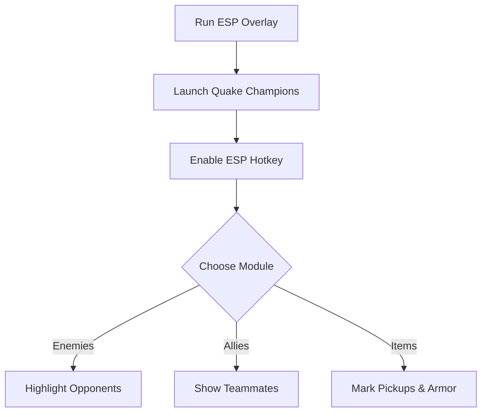

# Quake Champions ESP 👁️

The **Quake Champions ESP Overlay Software** gives players the tactical edge needed to thrive in chaotic arenas. By highlighting enemies, teammates, and valuable pickups in real time, this tool helps you **analyze duels, optimize routes, and refine map control**.

[](#)
[](#)
[](#)
[](#)

---

## 📝 Overview

Quake Champions is a high-speed FPS where every second counts. ESP (Extra Sensory Perception) overlays simplify the chaos, showing **player positions, health, and item spawns** directly on screen. Perfect for **training sessions, private matches, or offline testing**.

\[!IMPORTANT]
This overlay is designed for **offline and practice use** only. It does not modify game files.

---

## ⭐ Features

* **Enemy ESP** – See opponents through walls with health and distance indicators.
* **Ally ESP** – Track teammate positions for better coordination.
* **Item ESP** – Highlight armor, weapons, and health pickups.
* **Customizable Colors** – Set visuals for enemies, allies, and loot.
* **Distance Markers** – Measure spacing for tactical planning.
* **Hotkey Toggles** – Switch ESP features on or off instantly.

---

## 🖥 Compatibility

| Platform           | Supported | Notes                      |
| ------------------ | --------- | -------------------------- |
| Windows 10/11      | ✅         | Full support               |
| Steam              | ✅         | Stable overlay integration |
| Linux (Proton)     | ⚠️        | Limited functionality      |
| Consoles (Xbox/PS) | ❌         | Not supported              |

\[!NOTE]
Accessibility: Fonts, line thickness, and ESP colors are fully adjustable to improve clarity.

---

## ⚡ Setup Guide

1. **Download** the Quake Champions ESP package.
2. Extract files into your Quake Champions installation folder.
3. Run `QC_ESP.exe` as administrator.
4. Launch the game and press `INSERT` to enable overlays.
5. Customize ESP visuals in `config.ini` or via the overlay menu.

```ini
[esp]
enemy=red
ally=green
items=yellow
distance=true
```

---

## 🔄 ESP Workflow



---

## ❓ FAQ

**Q: Does ESP reduce performance?**
A: Minimal impact; optimized for fast-paced gameplay.

**Q: Can I toggle features during a match?**
A: Yes, hotkeys and the overlay menu allow on-the-fly adjustments.

**Q: Does it alter saves or stats?**
A: No, it runs only in memory and doesn’t touch your files.

**Q: Can I change ESP visuals?**
A: Yes, all colors, sizes, and labels are fully configurable.

**Q: Is VR supported?**
A: Not directly, but scaling options may help.

---

## 🚀 Final Thoughts

The **Quake Champions ESP Overlay Software** enhances **map awareness and tactical decision-making** by showing you hidden information at a glance. With configurable visuals and live toggles, it’s the perfect training companion for mastering the arena.

---


